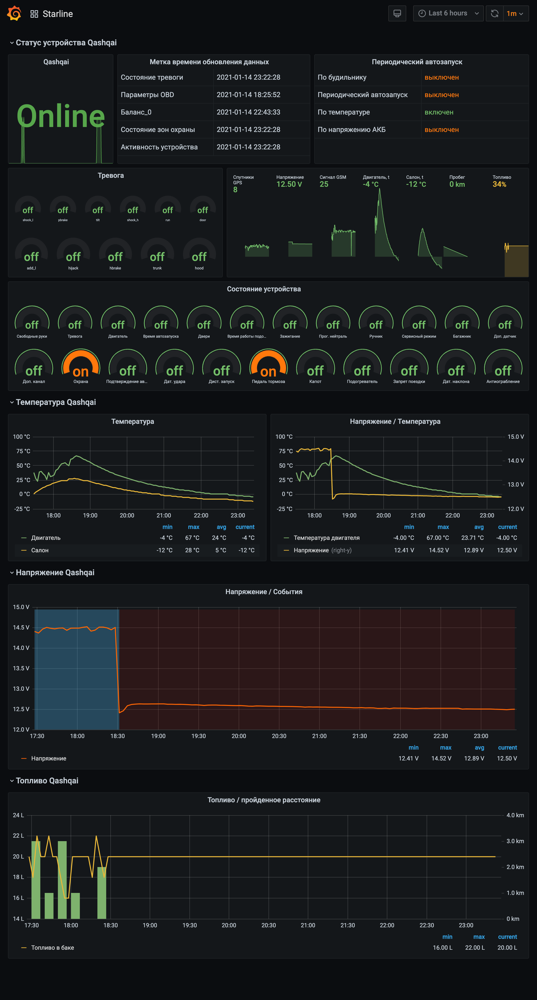

#SDS - Starline Device Statistics

##Описание
Starline Statistics - свободнораспростроняемый скрипт мониторинга охранного комплекса Starline.
Скрипт использует [Starline OpenAPI](https://developer.starline.ru) для чтения статуса охранного устройства и публикует считанные значение в виде метрик в стиле Prometheus.
Скрипт не хранит историю метрик, для хранения истории можно использовать Prometheus или Zabbix.
Для считывания метрик необходимо настроть скрепинг метрик с Prometheus по адресу запуска скрипта в соответсвии с портом публикации метри заданным в настройках с учетом времени опроса данных с серверов Starline.
Дополнительно метрики можно считывать сервисом Zabbix. Подробнее о настройке дашбордов в разделе [Дашборды](#Дашборды).

Скрипт поставляется в виде Dockerfile и docker-compose для сборки и запуска образа.

Так как скрипт читает значение с серверов Starline, получение актуальных данных зависит от длступности связи между сигнализацией и серверами Starline.
Для контроля актуальности данных необходимо следить за метриками отражающими метку времени обновления данных, такие метрики имеют суффикс **_ts**.

##Функционал
На текущий момент считываются данные только личных устройств.

Скрипт считывает и публикует следующие данные:
- Статус соединения с сервером
- Уникальный идентификатор устройства
- Имя устройства заданное пользователем при его добавлении или после эксплуатации
- Состояние устройства (Уровень приёма GSM сигнала, Уровень приёма GPS сигнала, Температура салона/двигателя, Напряжение АКБ, Метка времени обновления данных)
- Баланс
- Параметры OBD (Уровень топлива)
- Состояние зон охраны
- Состояние тревоги
- Настройки автозапуска

В разработке:
- Получение истории событий
- Получение ошибок OBD из кеша
- Чтение погоды в городе

##Установка скрипта

### Использование docker

1. Склонируйте проект

`git clone https://github.com/artiatoisa/starline.git`
2. Из корня проекта выполните

`docker-compose  up -d --build`

После выполнения команды будет собран образ и запущен контйнер.
Для проверки публикации метрик перейдите по ссылке http://docker-host:8180/metrics

### Запуск в виртуальном окружении python

В разработке


##Настройка

Перед использованием скрипта необходимо получить appId и appSecret.
Вы можете получить appId и appSecret в личном кабинете на my.starline.ru.
Этот appId и appSecret позволят вам управлять исключительно вашей машиной.
Подробней на [API Телематического сервиса StarLine](https://developer.starline.ru), раздел Регистрация.

Настройка скрипта осуществляется с использованием переменных окружения и конфигурационного файла.

**Переменные окружения**
- STARLINE_APP_ID - appId полученный на этапе регистрации в Starline API
- STARLINE_SECRET - appSecret полученный на этапе регистрации в Starline API
- STARLINE_LOGIN - имя пользователя от личного кабинета starline.online
- STARLINE_PASSWORD - пароль от личного кабинета starline.online
- STARLINE_UPDATE - интервал обновления данных с серверов Starline, минуты
- STARLINE_METRIC_PORT - порт публикации метрик


**Описание коефигурационного файла**

```
#app_id:
#secret:
#login:
#password:
datastore: JsonStore
update_data: 10
metric_port: 8080
logging:
  handlers:
    console:
      level: INFO
    file:
      level: INFO
      filename: starline.log
      maxBytes: 1048576
      backupCount: 10
```

<br/>**app_id** - appId полученный на этапе регистрации в Starline API
<br/>**secret** - appSecret полученный на этапе регистрации в Starline API
<br/>**login** - имя пользователя от личного кабинета starline.online
<br/>**password** - пароль от личного кабинета starline.online
<br/>**datastore** - место хранения токенов/кодов полученных при аутентификации
<br/>**update_data** - интервал обновления данных с серверов Starline, минуты
<br/>**metric_port** - порт публикации метрик
<br/>Секция logging:
<br/>**console:level** - уровень логирования в console
<br/>**file:level** - уровень логирования в файл
<br/>**file:filename** - имя лог файла
<br/>**file:maxBytes** - максимальный размер лога при ротации
<br/>**file:backupCount** - количество лог файлов при ротации

**Важно!**
Не рекомендуется устанавливать интервал обновления (update_data) сильно коротким, Starline накладывает ограничения на частоту обращения к API (1000 запросов в день для одного пользователя)
Подробней в разделе [Ограниченный доступ для физических лиц](https://developer.starline.ru/)


**Важно!**
<br/>Параметры переменных окружений имет больший приоритет!
При объявленнии параметров в переменных окружениях перезапишут значения определенные в конфигурационном файле.

##Дашборды

Для отоброжения метрик устройств созданы дашборды для Grafana к системам Zabbix и Prometheus.

###Zabbix

Дашборд для Zabbix и шаблон метрик доступны в каталоге `dashboards/Zabbix`
- Template_Starline.xml - шаблон метрик для Zabbix
- Starline.json - дашборд для загрузки в Grafana (требуется наличие плагина [Zabbix plugin for Grafana](https://github.com/alexanderzobnin/grafana-zabbix) и сконфигурированного datasource)



###Prometheus
В разработке